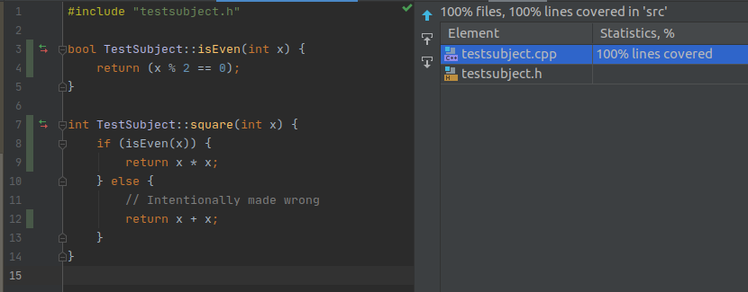
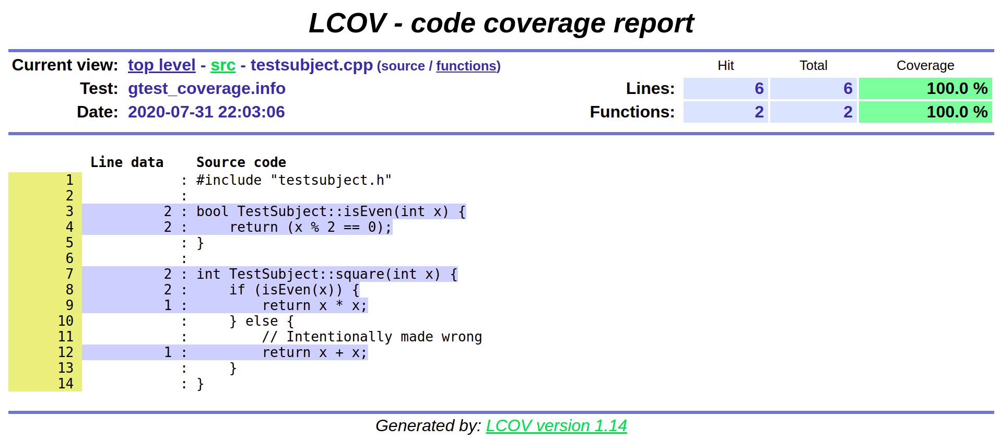

# C++ | Google Test | Gcov | Lcov

This repository demonstrates how to get coverage results with Google Test.

The CMake flag `set(CMAKE_CXX_FLAGS --coverage)` does the main job.

## Build instructions

```shell script
mkdir build
cd build
cmake ..
cmake --build .
```

This will create two executables: `main` and `test` in the `build` directory.

## Coverage

If you are using CLion, it becomes really easy to visualize coverage statistics. Just run the test with coverage and Clion will do the job.



To view the results with Gcov and Lcov as HTML, follow these commands (while you are still in the build directory):

```shell script
./test # Run the test at least once to generate the .gcda file
cd CMakeFiles/test.dir/src
gcov testsubject.cpp.gcno
lcov --capture --directory . --output-file gtest_coverage.info
genhtml gtest_coverage.info --output-directory CODE_COVERAGE
cd CODE_COVERAGE
```

Then open the generated `index.html` in `CODE_COVERAGE` directory to see the results in your browser.


